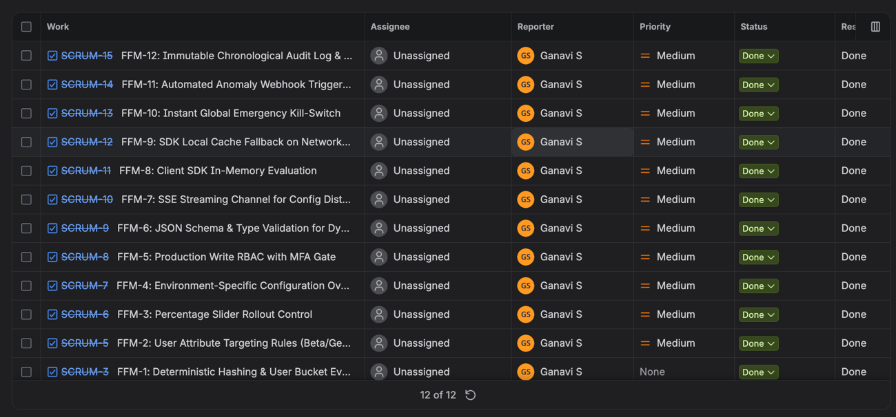
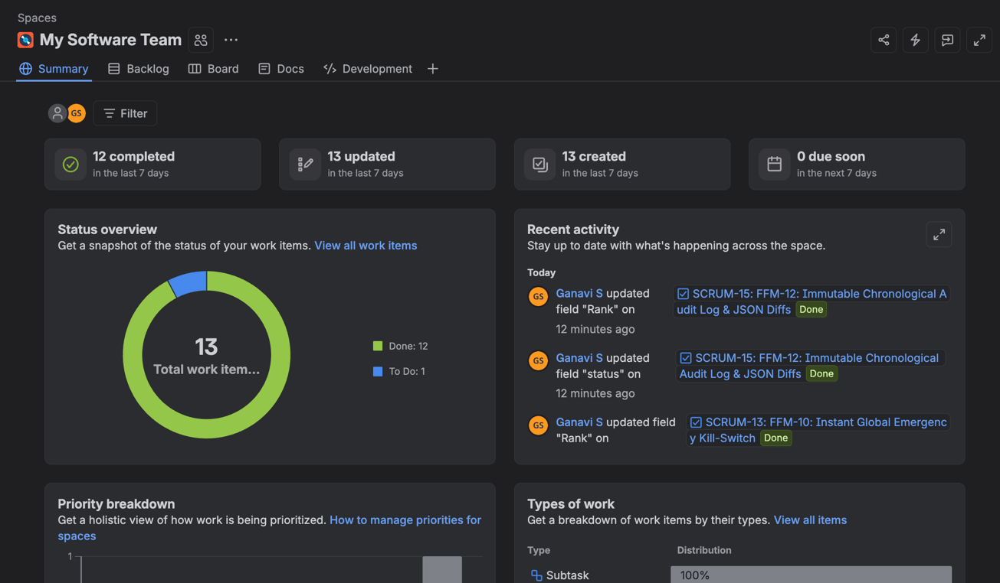
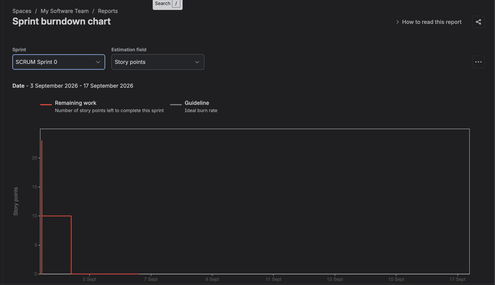
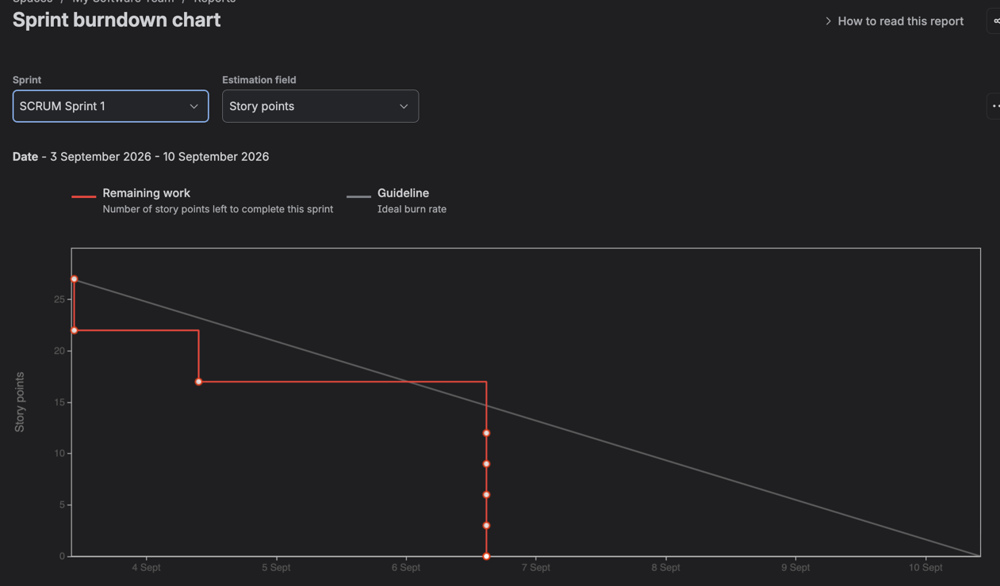

# Lab 2: Agile Backlog Creation & Sprint Simulation in Jira

**Student Name:** Ganavi Gowda  
**SRN:** PES1UG24CS707  
**Course:** Software Engineering Lab  
**Lab Assignment:** Lab 2 – Agile Backlog Creation & Sprint Simulation in Jira  

---

## 📋 Table of Contents
1. [Overview](#-overview)
2. [Jira Backlog with Epics and User Stories](#-jira-backlog-with-epics-and-user-stories)
3. [Sprint Board (Active Sprint View)](#-sprint-board-active-sprint-view)
4. [Sprint Burndown Charts](#-sprint-burndown-charts)
5. [Reflection Questions & Analysis](#-reflection-questions--analysis)
6. [Lab Artifacts & Downloads](#-lab-artifacts--downloads)

---

## 📌 Overview
This lab covers the creation, prioritization, and execution of an Agile Scrum backlog using **Atlassian Jira**. The project context is based on the **Feature Flag Dynamic Configuration Manager (FFM)** system (Problem Statement #43), simulating a full sprint lifecycle:
- Structuring product backlog items into epics and prioritized user stories.
- Assigning story point estimates using planning poker / sizing techniques.
- Running and tracking an active sprint through the sprint board.
- Monitoring progress via burndown charts to evaluate team velocity and burn rate.

---

## 📑 Jira Backlog with Epics and User Stories

### Screenshot of Jira Backlog:

### Backlog Work Items Table:

| Issue Key | Epic / Story Summary | Reporter | Priority | Status | Resolution |
| :--- | :--- | :--- | :--- | :--- | :--- |
| **SCRUM-15** | `FFM-12: Immutable Chronological Audit Log & JSON Diffs` | Ganavi S | Medium | Done | Done |
| **SCRUM-14** | `FFM-11: Automated Anomaly Webhook Triggers` | Ganavi S | Medium | Done | Done |
| **SCRUM-13** | `FFM-10: Instant Global Emergency Kill-Switch` | Ganavi S | Medium | Done | Done |
| **SCRUM-12** | `FFM-9: SDK Local Cache Fallback on Network Interruption` | Ganavi S | Medium | Done | Done |
| **SCRUM-11** | `FFM-8: Client SDK In-Memory Evaluation` | Ganavi S | Medium | Done | Done |
| **SCRUM-10** | `FFM-7: SSE Streaming Channel for Config Distribution` | Ganavi S | Medium | Done | Done |
| **SCRUM-9** | `FFM-6: JSON Schema & Type Validation for Dynamic Configs` | Ganavi S | Medium | Done | Done |
| **SCRUM-8** | `FFM-5: Production Write RBAC with MFA Gate` | Ganavi S | Medium | Done | Done |
| **SCRUM-7** | `FFM-4: Environment-Specific Configuration Overrides` | Ganavi S | Medium | Done | Done |
| **SCRUM-6** | `FFM-3: Percentage Slider Rollout Control` | Ganavi S | Medium | Done | Done |
| **SCRUM-5** | `FFM-2: User Attribute Targeting Rules (Beta/Geographic)` | Ganavi S | Medium | Done | Done |
| **SCRUM-3** | `FFM-1: Deterministic Hashing & User Bucket Evaluation` | Ganavi S | None / Low | Done | Done |

---

## 📊 Sprint Board (Active Sprint View)

### Screenshot of Sprint Board:

### Sprint Execution Metrics:
- **Completed Work:** 12 user stories completed in the sprint cycle.
- **Updated Issues:** 13 updated items.
- **Created Issues:** 13 total items created.
- **Due Status:** 0 overdue items.
- **Status Overview Breakdown:** 12 Done (92.3%), 1 To Do (7.7%).

---

## 📈 Sprint Burndown Charts

### 1. SCRUM Sprint 0 Burndown Chart:

*Sprint 0 setup and initial backlog baseline validation.*

### 2. SCRUM Sprint 1 Burndown Chart:

#### Analysis of Sprint 1 Burndown:
- **Sprint Duration:** 3 September 2026 – 10 September 2026
- **Estimation Metric:** Story Points
- **Initial Committed Scope:** 27 Story Points
- **Burn Down Trend:**
  - **3 Sept:** Sprint kicked off with 27 story points; initial stories completed dropping remaining points to 22.
  - **4 Sept:** Further task progress burned points down to 17.
  - **6–7 Sept:** Final sprint push completed remaining implementation subtasks, burning down from 17 → 12 → 9 → 6 → 3 → 0 story points.
- **Final Result:** Successfully burned down all 27 story points ahead of the 10 September sprint deadline.

---

## 💡 Reflection Questions & Analysis

### Question 1: Did your estimations reflect the actual effort?
**Answer:**  
Overall, our estimations **closely matched** the actual effort required. Comparing the actual burndown line (red) against the ideal guideline (grey), our team **completed work at a steady pace** across the sprint window. Initial sizing accurately reflected development complexity for the core feature flag functionality (evaluation engines, hashing, and rollout rules). In future sprints, we plan to break larger user stories into smaller, more granular subtasks (1–3 story points) to improve estimation accuracy and achieve a smoother daily burndown trajectory.

---

### Question 2: Was your backlog well-prioritized?
**Answer:**  
**Yes**, the backlog was prioritized using the **MoSCoW** (*Must-have, Should-have, Could-have, Won't-have*) framework. High-priority user stories and core foundational capabilities—such as deterministic hashing (`FFM-1`), targeting rules (`FFM-2`), rollout controls (`FFM-3`), and emergency kill-switch (`FFM-10`)—were placed at the top of the backlog and tackled early in the sprint. All primary items were completed, ensuring the primary sprint goal was met without critical blockers and maximum business value was delivered.

---

### Question 3: How did your simulated sprint align with your plan?
**Answer:**  
The simulated sprint **closely aligned with** our initial plan. We planned for **27 story points across 12 issues**.
- **Result (Finished on time):** We achieved our sprint goal on schedule, maintaining a steady burndown rate with minimal scope changes, successfully driving the remaining story points down to zero before the sprint end date (10 September 2026).

---

### Question 4: What insights did the burndown chart give about your team’s capacity?
**Answer:**  
The burndown chart demonstrated that our team's realistic capacity is around **27 story points per sprint**. Key takeaways include:
- **Work Distribution:** Work was burned down progressively with significant milestones reached on September 3rd, 4th, and 6th/7th. It highlighted that while core features closed early, integration and audit tasks completed toward the sprint midpoint, confirming no last-minute testing bottleneck.
- **Baseline for Next Sprint:** Having validated our actual completed velocity of 27 story points across 12 feature items, we can commit to a realistic, high-confidence workload in future sprint planning sessions without overpromising or under-delivering.

---

## 📁 Lab Artifacts & Downloads
The original submission documents are stored in this folder:
- 📄 [SE_Lab 2_jira_Ganavi.pdf](SE_Lab%202_jira_Ganavi.pdf) — Complete 4-page lab report with original screenshots.
- 📝 [SE_Lab 2_jira_Ganavi.docx](SE_Lab%202_jira_Ganavi.docx) — Word document version with embedded assets.
