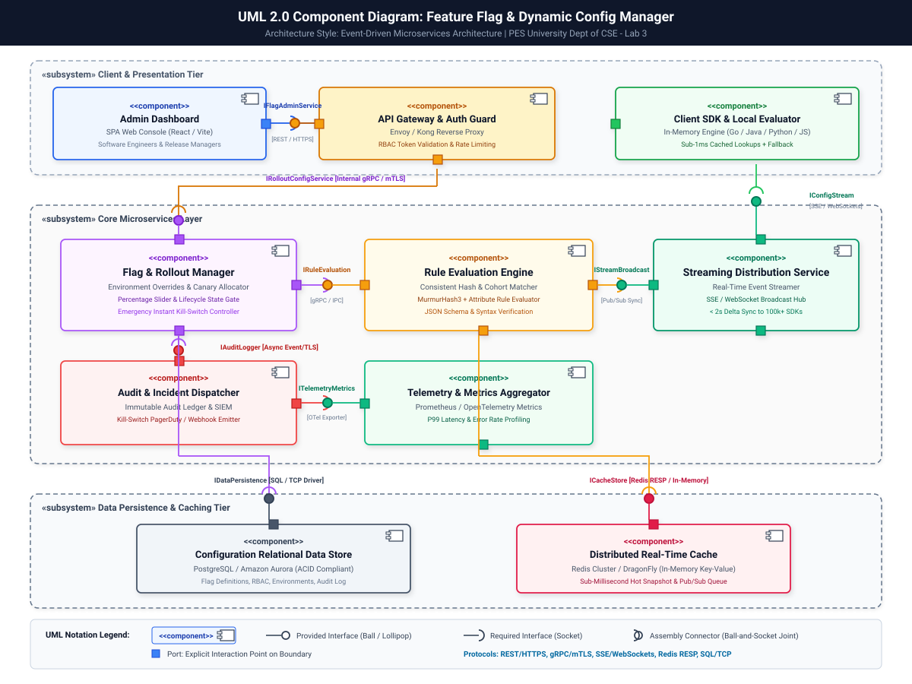
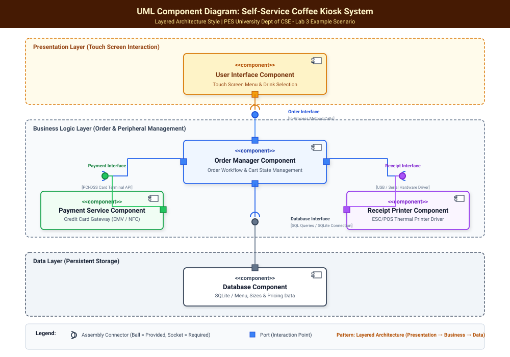

# Lab 3: Component Modelling & Architectural Pattern Selection

**Student Name:** Ganavi Gowda  
**SRN:** PES1UG24CS707  
**Course:** Software Engineering Lab (PES University - Dept. of CSE)  
**Lab Assignment:** Lab 3 – Component Modelling & Architectural Pattern Selection  
**Assigned System / Problem Statement #43:** Feature Flag & Dynamic Config Manager  
**Domain:** Developer Tools & IT Operations  
**Target Stakeholders / Actors:** Software Engineer, Release Manager  

---

## 📋 Table of Contents
1. [Objective & Learning Outcomes](#1-objective--learning-outcomes)
2. [Step 1: Scenario Review & Requirement Analysis](#2-step-1-scenario-review--requirement-analysis)
3. [Step 2: Architectural Style Analysis & Comparison](#3-step-2-architectural-style-analysis--comparison)
4. [Step 3: Architecture Selection & Component Identification](#4-step-3-architecture-selection--component-identification)
5. [Step 4: UML Component Diagram (UML 2.0)](#5-step-4-uml-component-diagram-uml-20)
6. [Step 5: Written Architectural Justification (1-Page Formal Submission)](#6-step-5-written-architectural-justification-1-page-formal-submission)
7. [Supplemental: Example Scenario (Self-Service Coffee Kiosk System)](#7-supplemental-example-scenario-self-service-coffee-kiosk-system)
8. [Lab Artifacts & Downloads](#8-lab-artifacts--downloads)

---

## 1. Objective & Learning Outcomes

### Objective:
Evaluate different architectural styles, select the most appropriate one for the assigned system (**Feature Flag & Dynamic Config Manager**), and create a comprehensive **UML Component Diagram** showing modules, provided/required interfaces, ports, and assembly connectors with concrete technical justifications.

### Learning Outcomes:
- **Evaluate Architectural Styles:** Compare and contrast Layered, Microservices, and Client-Server patterns relative to distributed developer tooling.
- **Select Appropriate Architecture:** Choose the optimal architectural style based on throughput, low-latency evaluation, and blast-radius containment.
- **Design Component Diagrams:** Construct formal UML 2.0 component diagrams adhering to standard ball-and-socket notation and port modeling.
- **Document Architectural Decisions:** Write technical justifications analyzing security boundaries and performance advantages.

---

## 2. Step 1: Scenario Review & Requirement Analysis

### Assigned Scenario Context:
A centralized configuration and feature toggling platform supporting percentage-based user cohort rollouts, multi-tier environment overrides (Dev/Staging/Prod), and real-time client SDK flag synchronization.

### Key Requirements Mapping:
- **Functional Requirements:**
  - **FR-001 (Rule-Based Targeting):** Boolean feature flag states and dynamic variable configurations evaluated based on User ID, cohort, device, and geo-attributes.
  - **FR-002 (Percentage Canary Rollouts):** Deterministic consistent hashing (MurmurHash3) across user IDs for gradual 0% to 100% rollouts.
  - **FR-003 (Environment Overrides):** Isolated configuration namespaces across Development, Staging, and Production.
  - **FR-004 (Real-Time SDK Sync):** Push-based distribution of delta updates via Server-Sent Events (SSE) / WebSockets within $< 2$ seconds.
  - **FR-005 (Emergency Kill-Switch):** Instant global kill switch disabling faulty features in $< 1$ second with immutable audit trail.
- **Non-Functional Requirements:**
  - **NFR-001 (Performance & Latency):** Sub-15ms API response latency and sub-1ms in-memory SDK cached evaluation under 50,000 req/s load.
  - **NFR-002 (Security & Governance):** Strict Role-Based Access Control (RBAC), TLS 1.3 transport encryption, and multi-factor authentication for production modifications.

### Core Architectural Challenges:
1. **Ultra-Low Latency Critical Path:** Flag evaluation occurs inside client-side request loops; any network latency directly slows down client applications.
2. **High Asymmetric Traffic Ratio:** SDK read/evaluation traffic ($100,000+\text{ req/s}$) outnumbers administrative dashboard write traffic ($10\text{ req/min}$) by orders of magnitude.
3. **Blast Radius & High Availability:** An administrative portal crash or database slowdown must never disrupt live flag evaluation on running client services.

---

## 3. Step 2: Architectural Style Analysis & Comparison

| Architectural Pattern | Structural Description | Key Advantages | Key Drawbacks | Suitability for Feature Flag System |
| :--- | :--- | :--- | :--- | :--- |
| **Layered (N-Tier) Architecture** | Horizontal monolithic layers: Presentation $\rightarrow$ Business Logic $\rightarrow$ Persistence. | • Simple to conceptualize and develop. • Clean separation of business logic from data access. | • Monolithic deployment unit. • Cannot scale high-throughput streaming independently from admin CRUD. • Database queries in evaluation path add latency. | ❌ **Poor Fit:** Violates sub-15ms evaluation requirement under 50k req/s traffic; single point of failure. |
| **Traditional Client-Server Architecture** | Centralized backend server directly serving multiple connected client applications. | • Centralized state authority. • Straightforward single-server deployment. | • Single point of failure. • Massive scalability bottleneck under millions of SDK polling requests. | ❌ **Poor Fit:** Server becomes saturated during traffic surges; unable to support edge-level sub-1ms evaluations. |
| **Microservices Architecture (Event-Driven Edge)** | Decomposed, independently deployable microservices communicating via gRPC, REST, and Pub/Sub streaming. | • **Independent Scalability:** Distribution nodes scale separately from Admin portals. • **Fault Isolation:** Admin dashboard downtime does not impair flag streaming. • **Edge Caching:** SDK in-memory evaluation decoupled from database. | • Requires operational orchestration (Docker/K8s). • Asynchronous event consistency management. | ✅ **Best Fit:** Perfectly handles asymmetric read/write loads, provides edge sub-1ms evaluations, and strict RBAC isolation. |

---

## 4. Step 3: Architecture Selection & Component Identification

### Architecture Selected:
**Event-Driven Microservices Architecture with Edge-Cached SDK Evaluation**

### Identified Components (8 Components Identified):

1. **`<<component>> Admin Dashboard`** *(Presentation Tier)*
   - **Role:** Web-based Single Page Application (React/Next.js) for Software Engineers and Release Managers.
   - **Ports & Interfaces:**
     - Requires: `IFlagAdminService` (Port `pAdmin` via REST/HTTPS)
     - Requires: `IAuthService` (Port `pAuth` via OAuth2/OIDC)

2. **`<<component>> API Gateway & Auth Guard`** *(Security & Ingress Tier)*
   - **Role:** Reverse proxy, rate limiter, and RBAC token validator (Envoy / Kong).
   - **Ports & Interfaces:**
     - Provides: `IFlagAdminService` (REST over TLS)
     - Requires: `IRolloutConfigService` (gRPC over mTLS)

3. **`<<component>> Flag & Rollout Manager`** *(Core Business Service)*
   - **Role:** Manages flag lifecycles, environment overrides, percentage sliders, and emergency kill-switches.
   - **Ports & Interfaces:**
     - Provides: `IRolloutConfigService` (Internal gRPC)
     - Requires: `IRuleEvaluation` (Rule validation engine)
     - Requires: `IAuditLogger` (Audit event logging)
     - Requires: `IDataPersistence` (Database connection pool)

4. **`<<component>> Targeting & Rule Evaluation Engine`** *(Evaluation Service)*
   - **Role:** High-speed cohort matching, MurmurHash3 consistent hashing, and JSON schema validation.
   - **Ports & Interfaces:**
     - Provides: `IRuleEvaluation` (High-speed IPC/gRPC)
     - Requires: `ICacheStore` (Redis distributed cache)

5. **`<<component>> Real-Time Streaming Distribution Service`** *(Distribution Service)*
   - **Role:** Long-lived SSE/WebSocket connection manager broadcasting instant flag deltas to connected SDKs.
   - **Ports & Interfaces:**
     - Provides: `IConfigStream` (SSE / WebSockets over TLS)
     - Requires: `IStreamBroadcast` (Redis Pub/Sub event subscriber)

6. **`<<component>> Audit Ledger & Incident Dispatcher`** *(Governance & Observability)*
   - **Role:** Immutable audit trail logging and automatic PagerDuty/Slack incident alerting upon kill-switch trigger.
   - **Ports & Interfaces:**
     - Provides: `IAuditLogger` (Asynchronous event broker)
     - Requires: `ITelemetryMetrics` (Prometheus/OpenTelemetry exporter)

7. **`<<component>> Telemetry & Metrics Aggregator`** *(Observability Service)*
   - **Role:** Collects P99 latency benchmarks, evaluation error rates, and canary health telemetry.
   - **Ports & Interfaces:**
     - Provides: `ITelemetryMetrics` (OTel collector)

8. **`<<component>> Relational Data Store & In-Memory Distributed Cache`** *(Persistence Tier)*
   - **Role:** PostgreSQL (ACID configurations, RBAC, audit ledger) + Redis Cluster (Hot snapshot cache & Pub/Sub).
   - **Ports & Interfaces:**
     - Provides: `IDataPersistence` (SQL / TCP driver)
     - Provides: `ICacheStore` (Redis RESP protocol)

9. **`<<component>> Client SDK & In-Memory Engine`** *(Client Runtime)*
   - **Role:** Embedded client-side/server-side library maintaining in-memory cache for $<1\text{ms}$ evaluations.
   - **Ports & Interfaces:**
     - Requires: `IConfigStream` (SSE/WebSocket listener)

---

## 5. Step 4: UML Component Diagram (UML 2.0)

### Visual Diagram:

### PlantUML Source Code:

```plantuml
@startuml
!theme plain
skinparam componentStyle uml2

package "Client & Ingress Subsystem" {
    [Admin Dashboard] <<component>> as UI
    [Client SDK & In-Memory Engine] <<component>> as SDK
    [API Gateway & Auth Guard] <<component>> as Gateway
}

package "Core Microservices Subsystem" {
    [Flag & Rollout Manager] <<component>> as FlagMgr
    [Targeting & Rule Evaluation Engine] <<component>> as RuleEngine
    [Real-Time Streaming Distribution Service] <<component>> as StreamService
    [Audit & Incident Dispatcher] <<component>> as AuditService
    [Telemetry & Metrics Aggregator] <<component>> as TelemetryService
}

package "Persistence & Caching Tier" {
    database "PostgreSQL Relational DB" as DB {
        [Configuration Relational Store] <<component>> as DBComp
    }
    database "Redis Cluster" as Redis {
        [Distributed Real-Time Cache] <<component>> as CacheComp
    }
}

' Assembly Connectors (Provided / Required Ball and Socket)
UI -( "IFlagAdminService [HTTPS/REST]"
"IFlagAdminService [HTTPS/REST]" - Gateway

Gateway -( "IRolloutConfigService [gRPC/mTLS]"
"IRolloutConfigService [gRPC/mTLS]" - FlagMgr

FlagMgr -( "IRuleEvaluation [gRPC/IPC]"
"IRuleEvaluation [gRPC/IPC]" - RuleEngine

RuleEngine -( "IStreamBroadcast [Pub/Sub]"
"IStreamBroadcast [Pub/Sub]" - StreamService

StreamService -(0- SDK : "IConfigStream [SSE/WebSockets]"

FlagMgr -( "IAuditLogger [Async Event]"
"IAuditLogger [Async Event]" - AuditService

AuditService -( "ITelemetryMetrics [OTel]"
"ITelemetryMetrics [OTel]" - TelemetryService

FlagMgr -( "IDataPersistence [SQL/TCP]"
"IDataPersistence [SQL/TCP]" - DBComp

RuleEngine -( "ICacheStore [Redis RESP]"
StreamService -( "ICacheStore [Redis RESP]"
"ICacheStore [Redis RESP]" - CacheComp

@enduml
```

---

## 6. Step 5: Written Architectural Justification (1-Page Formal Submission)

### Architecture Selection:
> **"We chose Event-Driven Microservices Architecture with Edge-Cached SDK Evaluation for the Feature Flag & Dynamic Config Manager System."**

### 1. Architectural Choice:
We selected an **Event-Driven Microservices Architecture** paired with a real-time Server-Sent Events (SSE) streaming distribution tier and decentralized SDK in-memory caching. The system decomposes administrative flag lifecycle management, deterministic rule evaluation, real-time config streaming, and audit logging into independently deployable, loosely-coupled microservices.

### 2. Two Specific Scenario-Related Reasons:
1. **Asymmetric Throughput & Independent Autoscaling:**  
   In a production feature flag platform, administrative configuration mutations (executed by Release Managers) occur at modest rates ($<10\text{ requests/min}$), whereas client evaluation and streaming sync requests execute at immense scale ($>100,000\text{ requests/sec}$). A microservices architecture enables us to horizontally scale the **Streaming Distribution Service** and **Rule Evaluation Engine** across container clusters dynamically without over-provisioning the database-heavy Flag Management CRUD service.
2. **Fault Isolation & Blast Radius Containment:**  
   Under high stress or transient failures in the Admin Dashboard, PostgreSQL database, or Audit Logging pipeline, the core feature evaluation mechanism remains completely unaffected. Because flag evaluation is performed locally in the **Client SDK's In-Memory Cache** and synchronized asynchronously via Redis Pub/Sub, client microservices never experience cascading failures or downtime when modifying release rules.

### 3. Security Advantage:
The architecture establishes defense-in-depth through an **API Gateway & Auth Guard** that enforces Role-Based Access Control (RBAC) and Multi-Factor Authentication (MFA) on all production write endpoints. Inter-service communications between internal microservices (e.g., Flag Manager $\leftrightarrow$ Rule Engine $\leftrightarrow$ Audit Ledger) are secured over **mutual TLS (mTLS) with internal service mesh identity tokens**, isolating sensitive environment override configurations from publicly accessible SDK streaming endpoints.

### 4. Performance Benefit:
By adopting edge-level SDK in-memory evaluations updated via push-based **Server-Sent Events (SSE)**, the system eliminates network round-trips for runtime flag checks. Client applications evaluate feature toggles against local memory in **under $1\text{ ms}$** (exceeding the $<15\text{ ms}$ requirement), while global rollout percentage changes propagate across distributed server fleets in **under $2\text{ seconds}$** without incurring database read bottlenecks.

---

## 7. Supplemental: Example Scenario (Self-Service Coffee Kiosk System)

As specified in the lab manual tutorial, here is the component model for the **Self-Service Coffee Kiosk System**:

### Selected Architecture:
**3-Tier Layered Architecture** (Presentation $\rightarrow$ Business $\rightarrow$ Data)

### Identified Components & Interfaces:
1. **`<<component>> User Interface Component`** *(Presentation Layer)*: Touch screen interface handling coffee selection (Espresso, Americano, Latte) and size choices (Small, Large).
2. **`<<component>> Order Manager Component`** *(Business Layer)*: Coordinates ordering workflows, calculates pricing totals, and dispatches transactions.
3. **`<<component>> Payment Service Component`** *(Business Layer)*: Communicates with credit card reader hardware and validates EMV/NFC transactions.
4. **`<<component>> Receipt Printer Component`** *(Business Layer)*: Formats order receipts and transmits ESC/POS print commands to thermal printer hardware.
5. **`<<component>> Database Component`** *(Data Layer)*: SQLite/Local database storing drink recipes, inventory, and menu pricing.

### Coffee Kiosk Component Diagram:

---

## 8. Lab Artifacts & Downloads

All official submission documents and diagrams are organized in this repository:
- 📊 **Vector Component Diagram (SVG):** [`assets/component_diagram.svg`](assets/component_diagram.svg)
- 📝 **Formal Word Document Submission:** [`SE_Lab_3_Component_Modelling_Ganavi.docx`](SE_Lab_3_Component_Modelling_Ganavi.docx)
- 📄 **Formal PDF Submission:** [`SE_Lab_3_Component_Modelling_Ganavi.pdf`](SE_Lab_3_Component_Modelling_Ganavi.pdf)
- 📐 **PlantUML Source Specification:** [`component_diagram.puml`](component_diagram.puml)
- ☕ **Tutorial Coffee Kiosk SVG:** [`assets/coffee_kiosk_component_diagram.svg`](assets/coffee_kiosk_component_diagram.svg)

---
**Lab 3 Completed Successfully! 🚀**
