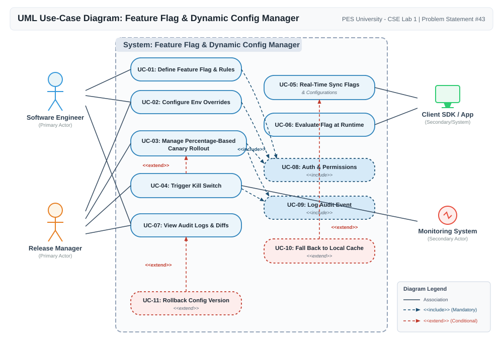
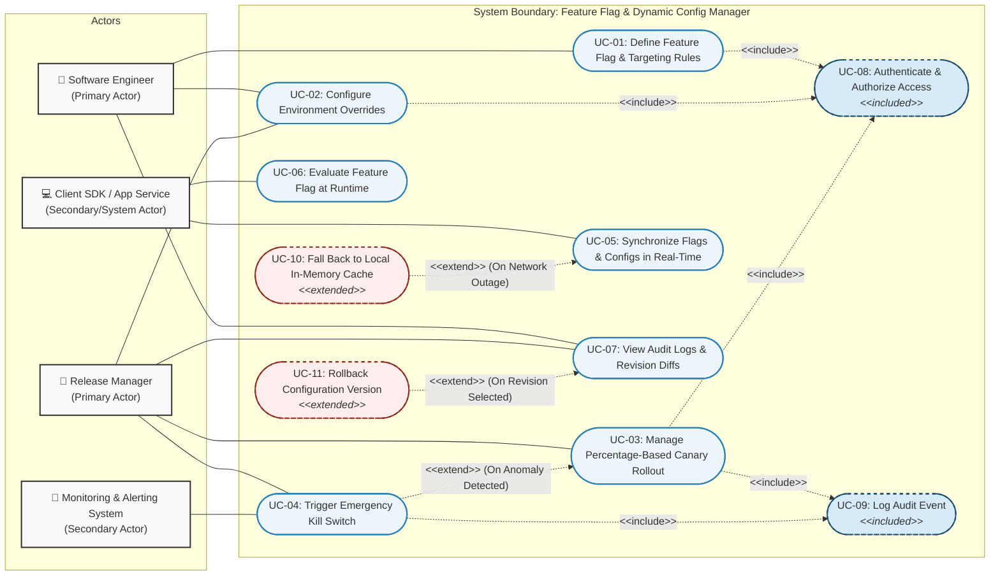

# Feature Flag & Dynamic Config Manager

### PES University - Department of Computer Science & Engineering
**Course**: Software Engineering Lab  
**Lab Assignment 1**: Requirements Engineering & UML Use-Case Modelling  
**Problem Statement #43**: Feature Flag & Dynamic Config Manager  
**Primary Domain**: Developer Tools & IT Operations  
**Target Stakeholders / Actors**: Software Engineer, Release Manager  
**GitHub Account**: [ganavigowda8343-ctrl](https://github.com/ganavigowda8343-ctrl)

---

## 📋 Table of Contents
1. [Problem Context & Overview](#1-problem-context--overview)
2. [Complete Requirements Specification](#2-complete-requirements-specification)
   - [Functional Requirements (FR-001 to FR-005)](#21-functional-requirements-fr-001-to-fr-005)
   - [Non-Functional Requirements (NFR-001 & NFR-002)](#22-non-functional-requirements-nfr-001--nfr-002)
3. [UML Use-Case Diagram](#3-uml-use-case-diagram)
   - [Visual Diagram](#31-visual-diagram)
   - [Mermaid Specification](#32-mermaid-specification)
   - [Actors & Stereotype Justifications](#33-actors--stereotype-justifications)
4. [Use-Case Flow Specification (UC-01)](#4-use-case-flow-specification-uc-01)
5. [Lab 2: Agile Backlog Creation & Sprint Simulation in Jira](#5-lab-2-agile-backlog-creation--sprint-simulation-in-jira)
6. [Repository Structure](#6-repository-structure)
7. [Submission & Verification Guide](#7-submission--verification-guide)

---

## 1. Problem Context & Overview

Modern distributed architectures require continuous deployment workflows where code can be deployed independently of feature releases. **Feature Flag & Dynamic Config Manager** is a centralized configuration and feature toggling platform supporting percentage-based user cohort rollouts, multi-environment overrides, real-time client SDK synchronization, and automated emergency kill-switches.

### Key Capabilities
- **Deterministic Cohort Partitioning**: Cryptographic hashing (e.g., MurmurHash3) to deterministically allocate users to canary buckets without storing state.
- **Multi-Tier Environment Overrides**: Independent configurations for Development, Staging, and Production with granular RBAC permissions.
- **Low-Latency Streaming Sync**: Server-Sent Events (SSE) / WebSockets to push configuration deltas to client SDKs in $<2$ seconds.
- **Sub-15ms Local In-Memory Evaluation**: SDK-level evaluation guaranteeing P99 latency $<15$ ms with zero synchronous network calls on user critical paths.
- **Automated Incident Mitigation**: One-click and automated metric-driven kill-switches to instantly neutralize production anomalies.

---

## 2. Complete Requirements Specification

### 2.1. Functional Requirements (FR-001 to FR-005)

| ID | Type | Description | Priority | Acceptance Criteria | Rationale |
| :--- | :--- | :--- | :--- | :--- | :--- |
| **FR-001** | Functional | The system shall evaluate dynamic user targeting rules (e.g., User ID hash, Beta cohort tag, email domain, geographic region) and return accurate, deterministic boolean feature flag states. | **High** | **Pass**: A 10% canary rollout cohort consistently evaluates to `true` for users whose hashed identifier falls within `[0, 10)`, and returns `false` for users outside the bucket.<br>**Fail**: A user outside the designated cohort or hash range receives an enabled flag state. | Enables safe canary testing and targeted experiment rollouts to minimize blast radius without code redeployments. |
| **FR-002** | Functional | The system shall allow configuration keys (strings, numbers, JSON schemas) and flag states to be set globally and overridden per environment (e.g., Development, Staging, Production) with role-based access control. | **High** | **Pass**: Modifying a configuration value or toggle in the `Staging` environment takes effect in Staging without altering the `Production` value; non-admin users cannot alter Production values.<br>**Fail**: Environment values bleed across environments or unauthorized users override production configuration. | Prevents configuration drift across deployment stages and allows safe pre-production validation of runtime flags. |
| **FR-003** | Functional | The system shall stream flag evaluation rules and dynamic configuration updates in real-time to connected client SDKs via Server-Sent Events (SSE) or WebSockets, with automatic in-memory cache sync. | **High** | **Pass**: Connected SDK client applications reflect published flag state changes in local memory within $\le 2$ seconds of publication without service restart.<br>**Fail**: Client SDK continues evaluating stale flag rules $> 2$ seconds after update or fails to reconcile after network reconnect. | Eliminates polling overhead and ensures critical operational toggle adjustments propagate immediately across distributed microservices. |
| **FR-004** | Functional | The system shall provide an instantaneous global emergency kill-switch mechanism to disable a feature flag or revert configuration to a default safe baseline across all client nodes in one operation. | **Critical** | **Pass**: Triggering the kill-switch propagates a disabled state to all active client SDK instances within 500 ms and logs the initiating actor and timestamp.<br>**Fail**: Flag remains active on cached client nodes after kill-switch activation, or partial rollout states persist. | Protects production system stability by immediately neutralizing critical bugs, memory leaks, or outages caused by newly released features. |
| **FR-005** | Functional | The system shall maintain an immutable, chronological audit log capturing all flag creations, rule modifications, percentage adjustments, and environment overrides, including actor identity, timestamp, previous state, and new state diff. | **Medium** | **Pass**: Every configuration mutation generates an immutable log entry displaying exact JSON diffs and actor credentials, viewable and filterable in the dashboard.<br>**Fail**: Configuration changes occur without an audit record, or log entries are editable/deletable. | Ensures security compliance, accountability, operational governance, and root-cause analysis during post-incident reviews. |

---

### 2.2. Non-Functional Requirements (NFR-001 & NFR-002)

| ID | Type | Description | Priority | Acceptance Criteria | Rationale |
| :--- | :--- | :--- | :--- | :--- | :--- |
| **NFR-001** | Performance & Latency | The feature flag evaluation API and SDK local in-memory evaluation engine must execute flag resolution with a P99 response latency of under 15 ms under a peak load of 50,000 requests per second (RPS). | **High** | **Pass**: Benchmark load testing confirms P99 latency $\le 15$ ms at 50,000 RPS with local cache hits $> 99.5\%$ and CPU utilization under 70%.<br>**Fail**: P99 latency exceeds 15 ms or evaluation engine introduces perceptible overhead to host application threads. | Feature flag evaluations sit directly on the synchronous critical path of user requests; any evaluation latency compounds overall system response time. |
| **NFR-002** | Security & High Availability | The system must enforce Role-Based Access Control (RBAC) with Multi-Factor Authentication (MFA) for production overrides and guarantee 99.99% service availability with graceful local cache fallback if the centralized backend becomes unreachable. | **Critical** | **Pass**: Unauthorized engineers are denied write access to Production flags, and client SDKs continue serving the last-known good cached configurations without throwing runtime exceptions during a full backend outage.<br>**Fail**: A centralized server outage causes client application crashes, or an unauthenticated request modifies production settings. | High availability and strict operational security guard against wide-scale service disruption and accidental misconfigurations in production. |

---

## 3. UML Use-Case Diagram

### 3.1. Visual Diagram



---

### 3.2. Mermaid Specification



---

### 3.3. Actors & Stereotype Justifications

#### Actors
1. **Software Engineer (Primary Actor)**: Defines feature flags, builds targeting rules, creates staging overrides, and validates flags in local/test environments.
2. **Release Manager (Primary Actor)**: Governs production rollout schedules, promotes percentage-based canary cohorts, monitors telemetry, and triggers rollbacks.
3. **Client SDK / Application Service (Secondary / System Actor)**: Consumes streaming configuration updates and locally executes sub-15ms flag evaluations.
4. **Monitoring & Alerting System (Secondary Actor)**: Observes telemetry (error rate, latency) and sends automated kill-switch signals via webhooks.

#### Stereotype Relationships
- **`«include»` Relationships**:
  - `UC-03 (Manage Rollout)` $\rightarrow$ `UC-08 (Authenticate & Authorize Access)`: Mandatory check before any production configuration change is accepted.
  - `UC-03 (Manage Rollout)` $\rightarrow$ `UC-09 (Log Audit Event)`: Every rollout adjustment must generate an immutable audit log entry.
- **`«extend»` Relationships**:
  - `UC-04 (Trigger Emergency Kill Switch)` $\rightarrow$ `UC-03 (Manage Rollout)`: Conditionally invoked via `OnMetricBreach` if health checks detect an error spike.
  - `UC-10 (Fall Back to Local Cache)` $\rightarrow$ `UC-05 (Synchronize Flags & Configs)`: Conditionally invoked via `OnNetworkFailure` when centralized backend streaming drops.

---

## 4. Use-Case Flow Specification (UC-01)

### Use-Case Metadata
- **Use Case ID**: `UC-01`
- **Use Case Name**: `Manage Percentage-Based Canary Rollout`
- **Primary Actor**: Release Manager
- **Secondary Actors**: Software Engineer, Client SDK, Monitoring System
- **Trigger**: Release Manager decides to initiate or adjust a progressive production rollout for an approved feature flag.

### Preconditions
1. Feature flag has been defined, tested, and validated in `Staging`.
2. Release Manager is authenticated with active Multi-Factor Authentication (MFA) and holds production write authorization.
3. Centralized backend streaming distribution service is healthy and connected to client SDKs.

### Postconditions
- **Success**: Rollout percentage (e.g., 25%) is persisted, an audit log is generated, real-time events are broadcasted to all SDKs within 2 seconds, and users in the target cohort deterministically evaluate to `true`.
- **Failure**: Flag rollout percentage remains at the previous stable value, no corrupt payload is broadcasted, and error details are logged.

### Main Success Scenario (Basic Flow)
```
1. Release Manager navigates to the Feature Flag Management Dashboard and selects the target flag (e.g., checkout_v2_redesign).
2. System retrieves flag metadata and displays current environment states, targeting rules, and active rollout percentage (e.g., 5%).
3. Release Manager selects the "Production" environment tab and inputs the new target rollout percentage (e.g., 25%).
4. Release Manager provides release change ticket reference (e.g., PROD-ROLLOUT-4402) and clicks "Submit Rollout Update".
5. System validates credentials and RBAC permissions [«include» Authenticate & Authorize Access].
6. System commits updated configuration and generates immutable audit entry [«include» Log Audit Event].
7. System broadcasts the updated flag rule over SSE streaming channels to all connected client SDKs.
8. Client SDKs update their local in-memory caches and acknowledge receipt via health ping.
9. System updates dashboard displaying rollout confirmation, active node count, and live telemetry metric stream.
```

### Alternate Flows
- **Alternate Flow 4A: Critical Telemetry Anomaly Detected (`«extend» Trigger Emergency Kill Switch`)**:
  - *4A.1*: Monitoring System detects an error rate spike ($>1.0\%$) or P99 latency breach on the 25% cohort.
  - *4A.2*: Automated webhook or Release Manager triggers Emergency Kill Switch.
  - *4A.3*: System forces flag state to 0% (disabled) globally and broadcasts kill event within 500 ms.
  - *4A.4*: Client SDKs instantly fall back to baseline feature code; incident alert is dispatched.
- **Alternate Flow 4B: Network Interruption during SDK Synchronization (`«extend» Fall Back to Local Cache`)**:
  - *4B.1*: Client SDK experiences network timeout/disconnect while receiving SSE updates.
  - *4B.2*: SDK switches to local in-memory cache to serve last-known good flag evaluations without throwing client-side runtime errors.
  - *4B.3*: SDK executes exponential backoff reconnects until connection is re-established, then reconciles delta state.

---

## 5. Lab 2: Agile Backlog Creation & Sprint Simulation in Jira

**Student:** Ganavi Gowda | **SRN:** PES1UG24CS707  
Detailed documentation and simulation reports for **Lab 2** are maintained in the [`Lab-2-Agile-Jira/`](Lab-2-Agile-Jira/README.md) directory.

### Highlights:
- **Product Backlog & Epics**: 12 core user stories (`FFM-1` to `FFM-12` / `SCRUM-3` to `SCRUM-15`) mapped from requirements into Jira.
- **Sprint Board**: Active sprint execution with 12 completed stories (100% of committed subtasks).
- **Burndown Charts**: Sprint 0 and Sprint 1 burndown graphs tracking velocity and burn rate across 27 story points to zero remaining work.
- **Reflection Analysis**: Comprehensive retrospective covering estimation accuracy, MoSCoW prioritization, velocity tracking, and capacity planning.

> 📁 **Full Report & Documentation**: [Lab-2-Agile-Jira/README.md](Lab-2-Agile-Jira/README.md)  
> 📄 **PDF Submission**: [Lab-2-Agile-Jira/SE_Lab 2_jira_Ganavi.pdf](Lab-2-Agile-Jira/SE_Lab%202_jira_Ganavi.pdf)  
> 📝 **Word Doc**: [Lab-2-Agile-Jira/SE_Lab 2_jira_Ganavi.docx](Lab-2-Agile-Jira/SE_Lab%202_jira_Ganavi.docx)

---

## 6. Repository Structure

```
feature-flag-dynamic-config-manager/
├── README.md                      # Main project documentation (Lab 1 & Lab 2)
├── Lab-2-Agile-Jira/             # Lab 2: Agile Jira Backlog & Sprint Simulation
│   ├── README.md                  # Comprehensive Lab 2 report with tables & answers
│   ├── SE_Lab 2_jira_Ganavi.pdf   # 4-page lab report PDF
│   ├── SE_Lab 2_jira_Ganavi.docx  # Word document version
│   └── screenshots/
│       ├── jira_backlog.png       # Jira backlog with Epics & User Stories
│       ├── sprint_board_active.png # Active sprint board view
│       ├── burndown_chart_sprint_0.png # Sprint 0 burndown chart
│       └── burndown_chart_sprint_1.png # Sprint 1 burndown chart (27 SP to 0)
├── docs/
│   ├── requirements.md            # Standalone Requirements Table (5 FRs, 2 NFRs)
│   ├── use-case-specification.md  # 1-page Use-Case Flow Specification (UC-01)
│   ├── use-case-diagram.md        # Mermaid-based UML diagram specification
│   ├── use-case-diagram.puml      # PlantUML diagram source code
│   └── use-case-diagram.svg       # Vector graphic diagram rendering
└── scripts/
    └── setup_git_and_push.sh      # Git helper script to push to GitHub
```

---

## 7. Submission & Verification Guide

### Pushing to GitHub Account: `ganavigowda8343-ctrl`

To upload changes to GitHub under the account `ganavigowda8343-ctrl`:

```bash
# 1. Navigate to the project directory
cd /Users/apple/.gemini/antigravity/scratch/feature-flag-dynamic-config-manager

# 2. Check git status
git status

# 3. Push commits to GitHub:
git push origin main
```

---
*Created for PES University CSE Department - Lab 1: Requirements Engineering & UML Use-Case Modelling.*
