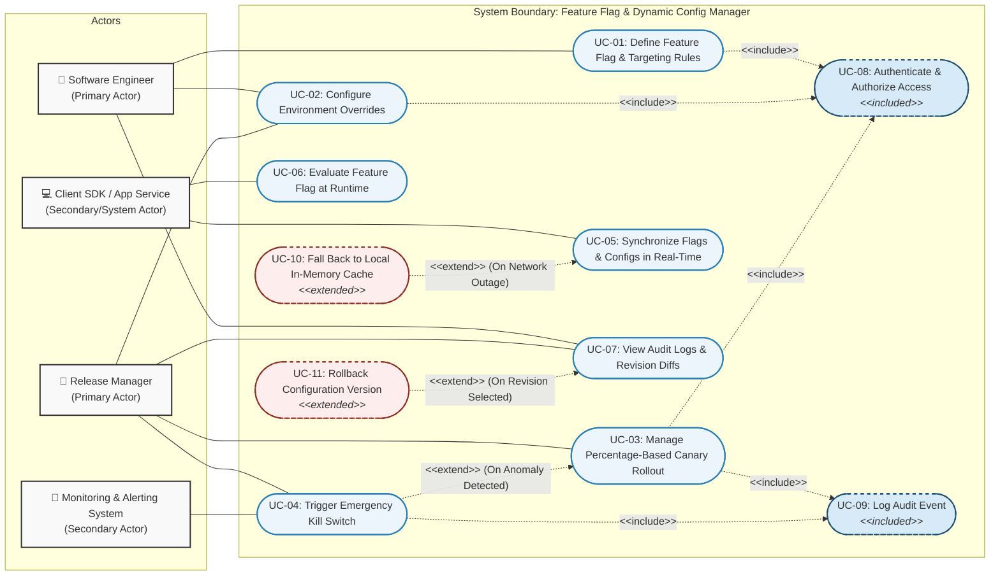

# UML Use-Case Diagram Specification

**Course**: PES University - Dept. of CSE  
**Lab Assignment**: Lab 1: Requirements Engineering & UML Use-Case Modelling  
**Problem Statement #43**: Feature Flag & Dynamic Config Manager  
**Primary Domain**: Developer Tools & IT Operations  

---

## 1. Visual Use-Case Diagram (Mermaid)

---

## 2. Actors Description

| Actor | Category | Description & Responsibilities |
| :--- | :--- | :--- |
| **Software Engineer** | Primary Actor (Human) | Creates and modifies feature flags, defines targeting rules (user attributes, beta testers), configures staging environment overrides, and verifies flag evaluations in development. |
| **Release Manager** | Primary Actor (Human) | Controls production release gates, orchestrates percentage-based canary rollouts, monitors release health telemetry, executes emergency rollbacks, and inspects audit logs. |
| **Client SDK / Application Service** | Secondary / System Actor | Integrated directly into backend microservices and frontend clients; maintains streaming connection with configuration server and resolves flag states locally with sub-15ms latency. |
| **Monitoring & Alerting System** | Secondary Actor (Automated System) | Ingests telemetry metrics (P99 latency, error rates) and automatically triggers emergency kill switches via webhooks when safety thresholds are violated. |

---

## 3. Relationships Justification

### A. `«include»` Relationships (Mandatory Sub-flows)
1. **`UC-03 (Manage Rollout)` $\xrightarrow{\text{«include»}}$ `UC-08 (Authenticate & Authorize Access)`**:
   - *Justification*: Any modification to production rollout percentages strictly requires identity verification and role-based authorization check before execution.
2. **`UC-03 (Manage Rollout)` $\xrightarrow{\text{«include»}}$ `UC-09 (Log Audit Event)`**:
   - *Justification*: Every rollout modification must unconditionally generate an immutable audit log entry for regulatory and compliance reasons.

### B. `«extend»` Relationships (Optional / Exceptional / Conditional Flows)
1. **`UC-04 (Trigger Emergency Kill Switch)` $\xrightarrow{\text{«extend»}}$ `UC-03 (Manage Percentage-Based Canary Rollout)`**:
   - *Extension Point*: `OnMetricBreach`
   - *Condition*: Triggered only if live health telemetry detects an error spike or latency breach during a canary release, instantly disabling the flag.
2. **`UC-10 (Fall Back to Local Cache)` $\xrightarrow{\text{«extend»}}$ `UC-05 (Synchronize Flags & Configs in Real-Time)`**:
   - *Extension Point*: `OnNetworkFailure`
   - *Condition*: Triggered only when the real-time SSE/WebSocket connection to the centralized configuration backend fails, allowing the client SDK to safely evaluate cached configurations without crashing.
